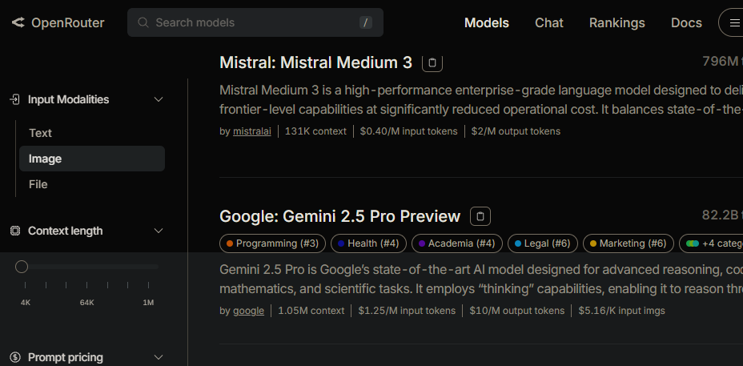
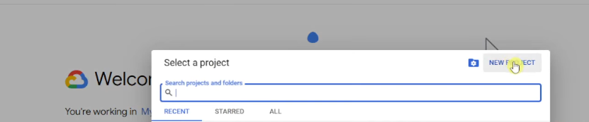

# RAG with n8n using OpenRouter, Google Gemini and Supabase

<p align="justify">
Implementation of a RAG (Retrieval-Augmented Generation) system in n8n for an online store, using OpenRouter, Google Gemini, and Supabase.
</p>

<p align="center">
  
</p>

---

## Embedding

<p align="center">
  
</p>

---

## Steps to implement RAG

### Step 1: Access n8n

Go to the official [n8n](https://n8n.io/) site and start a new workflow.

---

### Step 2: Configure OpenRouter

1. Visit [OpenRouter](https://openrouter.ai/).
2. Select the language model of your preference.
3. In this example, the free API was used with the openai/gpt-4o-mini model.
4. You just need to paste the API key and select the model.

<p align="center">
  
</p>

<p align="center">
  
</p>

---

### Step 3: Create a database in Supabase

1. Go to [Supabase](https://supabase.com/) and create a PostgreSQL database.
2. This database will be used to save and read embeddings, as well as store chat memory.

<p align="center">
  
</p>

3. Once the database is created, click on **Connect**.

<p align="center">
  
</p>

4. In the **Session Pooler** section, go to the parameters view and copy them.

<p align="center">
  
</p>

5. With the parameters (host, user, password, and port), configure the connection in PostgreSQL.

<p align="center">
  
</p>

---

### Step 4: Execute the flow in n8n

With the flow structure already configured in n8n, execute it to test the model's functionality and the creation of the histories table.

<p align="center">
  
</p>

<p align="center">
  
</p>

---

### Step 5: Add Supabase Vector Store

1. Add the Supabase Vector Store node in n8n.
2. Go to the database in Supabase, section **Settings > API**, and copy:
   - The **project URL**
   - The **service_role secret**

<p align="center">
  
</p>

3. Paste these credentials into the Supabase Vector Store node in n8n.

<p align="center">
  
</p>

---

### Step 6: Create the vector table in Supabase

1. If the previous step was successful, now the vector table must be created.
2. Supabase documents this in their [official guide](https://supabase.com/docs/guides/ai/langchain?database-method=sql).
3. Go to **SQL Editor**:

<p align="center">
  
</p>

4. Use the following adapted script, since in this case the text-embedding-004 embeddings model from Google is used, which generates vectors of size **768**, unlike the OpenAI model used in the official documentation.

> *Note: Make sure to modify the vector size according to the embedding model you are using.*

```sql
-- Enable the pgvector extension to work with embedding vectors
create extension if not exists vector; -- ADDED "IF NOT EXISTS"

-- Create a table to store your documents
create table documents (
  id bigserial primary key,
  content text, -- corresponds to Document.pageContent
  metadata jsonb, -- corresponds to Document.metadata
  embedding vector(768) -- Correct for text-embedding-004! Google, change if needed other embeddings supplier
);

-- Create a function to search for documents
create or replace function match_documents ( -- ADDED "OR REPLACE" in case it already existed
  query_embedding vector(768), -- Correct for text-embedding-004! Google, change if needed other embeddings supplier
  match_count int default null,
  filter jsonb DEFAULT '{}'
) returns table (
  id bigint,
  content text,
  metadata jsonb,
  similarity float
)
language plpgsql
as $$
#variable_conflict use_column
begin
  return query
  select
    documents.id,
    documents.content,
    documents.metadata,
    1 - (documents.embedding <=> query_embedding) as similarity
  from documents
  where metadata @> filter
  order by documents.embedding <=> query_embedding
  limit match_count;
end;
$$;
```

## Step 7: Create the documents table in Supabase

Execute the following SQL script in Supabase to create the documents table. This table will allow storing the text embeddings and querying them from the model.

<p align="center">
  
</p>

It is also important to correctly configure the connection parameters:

<p align="center">
  
</p>

---

## Step 8: Add Google Gemini embeddings

1. In n8n, select the previously configured embedding for Supabase Vector: text-embedding-004.

<p align="center">
  
</p>

<p align="center">
  
</p>

2. For the text-embedding-004 model credentials:
   - Access [Google Studio AI](https://makersuite.google.com/).
   - Create an API Key and copy it.

<p align="center">
  
</p>

3. Paste the API Key into the embeddings node in n8n.

<p align="center">
  
</p>

---

## Step 9: Link Google Drive to load data

1. Access [Google Cloud Console](https://cloud.google.com/) (it's free).
2. Create a new project:

<p align="center">
  
</p>

3. Select the created project, go to **"API & Services" > "OAuth consent screen"** and complete the required fields:

<p align="center">
  
</p>

4. Then, in **"Credentials"**, create the necessary credentials:

<p align="center">
  
</p>

<p align="center">
  
</p>

<p align="center">
  
</p>

5. Copy the **Client ID** and **Client Secret**, and configure them in n8n to enable "Sign in with Google":

<p align="center">
  
</p>

6. Make sure to enable the Google Drive API in the project:

<p align="center">
  
</p>

7. Upload the dataCompany.txt file to your Google Drive. Open the file from the three-dot menu and choose **"Open in a new tab"**, then copy the URL:

<p align="center">
  
</p>

---

## Step 10: Add documents to the Supabase Vector Store

1. In n8n, add the **Supabase Vector Store** node and select the **"Add documents to vector store"** option.

<p align="center">
  
</p>

2. Select the documents table as the destination for the embeddings.

<p align="center">
  
</p>

---

## Step 11: Use Google Gemini embeddings

Make sure you have correctly configured the embeddings node with text-embedding-004.

<p align="center">
  
</p>

---

## Step 12: Use the "Data Loader" node of Binary type

This node allows loading the text file from Google Drive.

<p align="center">
  
</p>

---

## Step 13: Split the text with "Recursive Character Text Splitter"

Use this node with a **chunk size** of 1000 to split the content into manageable fragments.

<p align="center">
  
</p>

---

## Step 14: Execute the Supabase Vector Store

With all nodes configured, execute the flow to store the text embeddings.

<p align="center">
  
</p>

---

## Step 15: Verify storage in the documents table

Once executed, you'll be able to visualize the embeddings correctly stored in Supabase:

<p align="center">
  
</p>

---

## Step 16: Test the RAG agent with a query

Ask a question in Spanish to the model, for example:

> **Hello, could you please give me information about the BrandStore store?**

The model responds using the vectorized information from the file.

<p align="center">
  
</p>

-----
Here is information about the BrandStore store:

### General Description
Welcome to BrandStore, your destination to discover a universe of products that fuse style, functionality, and consciousness! At BrandStore, each item tells a story and every purchase brings you closer to a more inspired and organized lifestyle. We believe that the objects around us should be beautiful and useful, so we offer a diverse collection ranging from everyday essentials to those whims that cheer the soul.

### Product Catalog
At BrandStore, you'll find a wide range of products, which includes:
- Clothing
- Notebooks
- Notepads
- Books
- Bottles
- And many other fascinating items

We invite you to explore our online store and take advantage of our special offers and star products.

### Premium Experience Service
For just $15, you can access a superior level of attention. This service includes:
- Deeper consultations on how to integrate our products into your life
- Early access to new items and limited collections
- Possibility to request small customizations on selected items (subject to availability)

### BrandStore Commitment
We are committed to quality, innovative design, and sustainability. We seek to offer aesthetically pleasing, durable products manufactured responsibly.

### Featured Product
- **Description**: "Books with different colors". A charming collection of books with vibrant color covers, perfect for adding joy to your space.
- **Category**: Beautiful books
- **Explore the collection**: [Here](https://shoptest-diegoperea.vercel.app/products/10)

BrandStore goes beyond simply selling products, offering services designed to complement your shopping experience. Thank you for considering BrandStore for your search for style, organization, and inspiration! Happy shopping!

---

# ⚠️ Importance of Organizing and Structuring Text for Embedding

> 📌 **VERY IMPORTANT!**  
> For a Retrieval Augmented Generation (RAG) model to work correctly, **the source text must be well organized and structured**.

---

### ❓ Why is it so important?

When you ask a question like:

> 🗨️ _"What are the star products?"_

the model needs to find a relevant text fragment among all the vectorized documents.  
**If the original text is disorganized, ambiguous, or poorly structured, the RAG will have difficulties understanding and locating the appropriate answer.**


## Featured Article

### Golden Scissors

- **Original Price:** $10
- **Discounted Price:** $5.00 (50% OFF)
- **Description:** Add a touch of elegance and sophistication to your space with these golden scissors, combining precision and attractive design.
[Get it here](https://shoptest-diegoperea.vercel.app/products/2)

### Books Colors

- **Price:** $11
- **Description:** A charming collection of books with vibrant color covers.
[Explore this product](https://shoptest-diegoperea.vercel.app/products/6)

We invite you to explore more in our online store, where there's always something new and exciting to discover. Happy shopping!


---

# ❗ Problem: Incorrect Links Due to Poorly Cut Chunks

> 🧠 Although the product information is **correct**, the model generates **erroneous links**.  
> This is due to how the text was **fragmented (chunked)** during the embedding process.

---

## 🔍 What exactly happened?

During text processing to create embeddings, the content was cut into fragments (chunks).  
In doing so, **the links were separated from the product context**, generating confusion.

---

### ⚠️ Example observed in **chunk 5**:

```text
Find it here: https://shoptest-diegoperea.vercel.app/products/2
Tijeras Scissors:
Original Price: $10
Discounted Price: $5.00 (50% OFF!)
Description: "Golden scissors". Add a touch of elegance and sophistication to your desk or craft space with these impressive golden scissors. They are not only a precise and efficient cutting tool but also a design object that will embellish any corner. An opportunity you can't miss!
Category: scissors golden beautiful
Get them with discount here: https://shoptest-diegoperea.vercel.app/products/6
Books colors:
Price: $11
```


---

### ✅ Good practices when preparing your text for embedding

- Use clear titles and subtitles (for example: Featured Products, Return Policy, etc.).
- Write complete sentences, without abbreviations or grammatical errors.
- Group information by sections or categories.
- Avoid repeating unnecessary information.
- Use lists to enumerate important elements.

---

# ✅ Recommendation: Organize the Context According to Chunk Size

> 🧠 To avoid errors such as decontextualized links or inaccurate answers, it is **key to correctly organize the content** before performing embeddings.

---

## 📐 Adjust the content according to the **chunk size** you're going to use

When fragmenting the text (chunking), make sure that **each fragment retains the complete context** of the topic it deals with (for example, a product with its description and its link).  
Otherwise, you could end up with cut-off or poorly related information, leading to errors in the RAG model.

---

### 💡 What does Chunkerizer do?

- Divides your input text using a customized chunk size and overlap configuration.
- Visually shows how the fragments will be organized.
- Allows adjusting the content before sending it to a vector store like Supabase.

---

## 📌 Final recommendation

Before processing your data:

1. **Organize the text** into logical and complete blocks.
2. **Visualize the chunks with Chunkerizer.**
3. **Adjust the chunk size** if you notice that the information is being cut off poorly.
4. **Validate the generated fragments** before performing the embedding.

---

> 🧠 Good content structure = better information retrieval in your RAG.
>

## 🛠️ Recommended tool: **Chunkerizer**

To visualize how chunks will be divided from your .txt file, you can use the following tool:

🔗 [Chunkerizer - Visualize your chunks](https://chunkerizer.streamlit.app/)

---

# 🎥 Support Videos for Implementing RAG with n8n

> 💡 These resources will help you understand and implement each part of the process with greater ease. From RAG creation to credential configuration and n8n installation.

---

## 1️⃣ **Creating RAG in n8n**
🔗 [Watch video on YouTube](https://www.youtube.com/watch?v=-TpJE2-41aA)  
Step-by-step explanation for setting up a RAG system using n8n, OpenRouter, Google Gemini, and Supabase.

---

## 2️⃣ **Configuring Google Drive Credentials in n8n**
🔗 [Watch video on YouTube](https://www.youtube.com/watch?v=3Ai1EPznlAc)  
Learn how to correctly generate and configure Google Drive credentials to integrate them into your n8n flows.

---

## 3️⃣ **Installing n8n on Your Own Server (Free and Secure)**
🔗 [Watch video on YouTube](https://www.youtube.com/watch?v=LLEBQjkjpOI)  
Complete tutorial for installing n8n for free on your own server, ideal for production.

---

## 4️⃣ **Local and Cloud Installation of n8n**
🔗 [Watch video on YouTube](https://www.youtube.com/watch?v=3PplQyNm7No)  
Discover how you can run n8n both locally and in the cloud for greater flexibility.

---

> 🧠 These videos are highly recommended if it's your first time working with n8n and you want to avoid common errors.

---


Created by [Diego Ivan Perea Montealegre](https://github.com/diegoperea20)

---
---

# Spanish
# RAG con n8n usando OpenRouter, Google Gemini y Supabase

<p align="justify">
Implementación de un sistema RAG (Retrieval-Augmented Generation) en n8n para una tienda online, utilizando OpenRouter, Google Gemini y Supabase.
</p>

<p align="center">
  
</p>

---

## Embedding

<p align="center">
  
</p>

---

## Pasos para implementar RAG

### Paso 1: Acceder a n8n

Ir al sitio oficial de [n8n](https://n8n.io/) y comenzar un nuevo flujo de trabajo.

---

### Paso 2: Configurar OpenRouter

1. Visita [OpenRouter](https://openrouter.ai/).
2. Selecciona el modelo de lenguaje de tu preferencia.
3. En este ejemplo se utilizó la API gratuita con el modelo `openai/gpt-4o-mini`.
4. Solo debes pegar la API key y seleccionar el modelo.

<p align="center">
  
</p>

<p align="center">
  
</p>

---

### Paso 3: Crear base de datos en Supabase

1. Ir a [Supabase](https://supabase.com/) y crear una base de datos PostgreSQL.
2. Esta base de datos se usará para guardar y leer los embeddings, además de almacenar la memoria del chat.

<p align="center">
  
</p>

3. Una vez creada la base de datos, haz clic en **Connect**.

<p align="center">
  
</p>

4. En la sección **Session Pooler**, ve a la vista de parámetros y cópialos.

<p align="center">
  
</p>

5. Con los parámetros (host, usuario, contraseña y puerto), configura la conexión en PostgreSQL.

<p align="center">
  
</p>

---

### Paso 4: Ejecutar flujo en n8n

Con la estructura del flujo ya configurada en n8n, ejecútalo para probar el funcionamiento del modelo y la creación de la tabla `histories`.

<p align="center">
  
</p>

<p align="center">
  
</p>

---

### Paso 5: Agregar Supabase Vector Store

1. Añadir el nodo de Supabase Vector Store en n8n.
2. Ir a la base de datos en Supabase, sección **Settings > API**, y copiar:
   - La **URL del proyecto**
   - El **`service_role` secret**

<p align="center">
  
</p>

3. Pegar estas credenciales en el nodo de Supabase Vector Store en n8n.

<p align="center">
  
</p>

---

### Paso 6: Crear la tabla vectorial en Supabase

1. Si el paso anterior fue exitoso, ahora se debe crear la tabla vectorial.
2. Supabase lo documenta en su [guía oficial](https://supabase.com/docs/guides/ai/langchain?database-method=sql).
3. Ir a **SQL Editor**:

<p align="center">
  
</p>

4. Usar el siguiente script adaptado, ya que en este caso se utiliza el modelo de embeddings `text-embedding-004` de Google, que genera vectores de tamaño **768**, a diferencia del modelo de OpenAI usado en la documentación oficial.

> *Nota: Asegúrate de modificar el vector size según el modelo de embedding que estés utilizando.*


```sql
-- Enable the pgvector extension to work with embedding vectors
create extension if not exists vector; -- AÑADIDO "IF NOT EXISTS"

-- Create a table to store your documents
create table documents (
  id bigserial primary key,
  content text, -- corresponds to Document.pageContent
  metadata jsonb, -- corresponds to Document.metadata
  embedding vector(768) -- ¡Correcto para text-embedding-004! Google ,change if needed other embeddings supplier
);

-- Create a function to search for documents
create or replace function match_documents ( -- AÑADIDO "OR REPLACE" por si ya existía
  query_embedding vector(768), -- ¡Correcto para text-embedding-004! Google,change if needed other embeddings supplier
  match_count int default null,
  filter jsonb DEFAULT '{}'
) returns table (
  id bigint,
  content text,
  metadata jsonb,
  similarity float
)
language plpgsql
as $$
#variable_conflict use_column
begin
  return query
  select
    documents.id,
    documents.content,
    documents.metadata,
    1 - (documents.embedding <=> query_embedding) as similarity
  from documents
  where metadata @> filter
  order by documents.embedding <=> query_embedding
  limit match_count;
end;
$$;
```
## Paso 7: Crear la tabla `documents` en Supabase

Ejecuta el siguiente script SQL en Supabase para crear la tabla `documents`. Esta tabla permitirá almacenar los embeddings del texto y consultarlos desde el modelo.

<p align="center">
  
</p>

También es importante configurar correctamente los parámetros de conexión:

<p align="center">
  
</p>

---

## Paso 8: Agregar embeddings de Google Gemini

1. En n8n, selecciona el embedding previamente configurado para Supabase Vector: `text-embedding-004`.

<p align="center">
  
</p>

<p align="center">
  
</p>

2. Para las credenciales del modelo `text-embedding-004`:
   - Accede a [Google Studio AI](https://makersuite.google.com/).
   - Crea una API Key y cópiala.

<p align="center">
  
</p>

3. Pega la API Key en el nodo de embeddings en n8n.

<p align="center">
  
</p>

---

## Paso 9: Vincular Google Drive para cargar datos

1. Accede a [Google Cloud Console](https://cloud.google.com/) (es gratuito).
2. Crea un nuevo proyecto:

<p align="center">
  
</p>

3. Selecciona el proyecto creado, ve a **"API & Services" > "OAuth consent screen"** y completa los campos obligatorios:

<p align="center">
  
</p>

4. Luego, en **"Credentials"**, crea las credenciales necesarias:

<p align="center">
  
</p>

<p align="center">
  
</p>

<p align="center">
  
</p>

5. Copia el **Client ID** y **Client Secret**, y configúralos en n8n para habilitar "Sign in with Google":

<p align="center">
  
</p>

6. Asegúrate de habilitar la API de Google Drive en el proyecto:

<p align="center">
  
</p>

7. Sube el archivo `dataCompany.txt` a tu Google Drive. Abre el archivo desde el menú de tres puntos y elige **"Abrir en una nueva pestaña"**, luego copia la URL:

<p align="center">
  
</p>

---

## Paso 10: Agregar documentos al Supabase Vector Store

1. En n8n, añade el nodo **Supabase Vector Store** y selecciona la opción **"Add documents to vector store"**.

<p align="center">
  
</p>

2. Selecciona la tabla `documents` como destino de los embeddings.

<p align="center">
  
</p>

---

## Paso 11: Usar los embeddings de Google Gemini

Asegúrate de tener correctamente configurado el nodo de embeddings con `text-embedding-004`.

<p align="center">
  
</p>

---

## Paso 12: Usar el nodo "Data Loader" de tipo Binary

Este nodo permite cargar el archivo de texto desde Google Drive.

<p align="center">
  
</p>

---

## Paso 13: Dividir el texto con "Recursive Character Text Splitter"

Utiliza este nodo con un **chunk size** de 1000 para dividir el contenido en fragmentos manejables.

<p align="center">
  
</p>

---

## Paso 14: Ejecutar el Supabase Vector Store

Con todos los nodos configurados, ejecuta el flujo para almacenar los embeddings del texto.

<p align="center">
  
</p>

---

## Paso 15: Verificar almacenamiento en la tabla `documents`

Una vez ejecutado, podrás visualizar los embeddings correctamente almacenados en Supabase:

<p align="center">
  
</p>

---

## Paso 16: Probar el agente RAG con una consulta

Realiza una pregunta en español al modelo, por ejemplo:

> **Hola, ¿me podrías dar por favor información de la tienda BrandStore?**

El modelo responde utilizando la información vectorizada del archivo.

<p align="center">
  
</p>

-----
Aquí tienes información sobre la tienda BrandStore:

### Descripción General
¡Bienvenido a BrandStore, tu destino para descubrir un universo de productos que fusionan estilo, funcionalidad y conciencia! En BrandStore, cada artículo cuenta una historia y cada compra te acerca a un estilo de vida más inspirado y organizado. Creemos que los objetos a nuestro alrededor deben ser hermosos y útiles, por lo que ofrecemos una colección diversa que va desde lo esencial del día a día hasta esos caprichos que alegran el alma.

### Catálogo de Productos
En BrandStore, encontrarás una amplia gama de productos, que incluye:
- Ropa
- Cuadernos
- Libretas
- Libros
- Botellas
- Y muchos otros artículos fascinantes

Te invitamos a explorar nuestra tienda en línea y aprovechar nuestras ofertas especiales y productos estrella.

### Servicio de Experiencia Premium
Por solo $15, puedes acceder a un nivel superior de atención. Este servicio incluye:
- Consultas más profundas sobre cómo integrar nuestros productos en tu vida
- Acceso anticipado a novedades y colecciones limitadas
- Posibilidad de solicitar pequeñas personalizaciones en artículos seleccionados (sujeto a disponibilidad)

### Compromiso de BrandStore
Nos comprometemos con la calidad, el diseño innovador y la sostenibilidad. Buscamos ofrecer productos estéticamente agradables, duraderos y fabricados de manera responsable.

### Producto Destacado
- **Descripción**: "Books with different colors". Una colección encantadora de libros con vibrantes portadas de colores, perfectos para añadir alegría a tu espacio.
- **Categoría**: Libros bonitos
- **Explora la colección**: [Aquí](https://shoptest-diegoperea.vercel.app/products/10)

BrandStore va más allá de la simple venta de productos, ofreciendo servicios diseñados para complementar tu experiencia de compra. ¡Gracias por considerar BrandStore para tu búsqueda de estilo, organización e inspiración! ¡Felices compras!

---

# ⚠️ Importancia de Organizar y Estructurar el Texto para Embedding

> 📌 **¡MUY IMPORTANTE!**  
> Para que un modelo de Recuperación aumentada por generación (RAG) funcione correctamente, **el texto fuente debe estar bien organizado y estructurado**.

---

### ❓ ¿Por qué es tan importante?

Cuando haces una pregunta como:

> 🗨️ _"¿Cuáles son los artículos estrella?"_

el modelo necesita encontrar un fragmento de texto relevante entre todos los documentos vectorizados.  
**Si el texto original está desordenado, ambiguo o mal estructurado, el RAG tendrá dificultades para comprender y localizar la respuesta adecuada.**


## Artículo Destacado

### Tijeras Doradas

- **Precio Original:** $10
- **Precio con Descuento:** $5.00 (50% OFF)
- **Descripción:** Añade un toque de elegancia y sofisticación a tu espacio con estas tijeras doradas, combinando precisión y diseño atractivo.
[Consíguelo aquí](https://shoptest-diegoperea.vercel.app/products/2)

### Books Colors

- **Precio:** $11
- **Descripción:** Una colección encantadora de libros con vibrantes portadas de colores.
[Explora este producto](https://shoptest-diegoperea.vercel.app/products/6)

Te invitamos a explorar más en nuestra tienda en línea, donde siempre hay algo nuevo y emocionante por descubrir. ¡Felices compras!


---

# ❗ Problema: Links Incorrectos Debido a Chunks Mal Cortados

> 🧠 Aunque la información del producto es **correcta**, el modelo genera **links erróneos**.  
> Esto se debe a cómo se **fragmentó (chunked)** el texto al realizar el proceso de embedding.

---

## 🔍 ¿Qué ocurrió exactamente?

Durante el procesamiento del texto para crear embeddings, se cortó el contenido en fragmentos (chunks).  
Al hacerlo, **los links quedaron separados del contexto del producto**, generando confusión.

---

### ⚠️ Ejemplo observado en el **chunk 5**:

```text
Encuéntralo aquí: https://shoptest-diegoperea.vercel.app/products/2
Tijeras Scissors:
Precio Original: $10
Precio con Descuento: $5.00 (¡50% OFF!)
Descripción: "Tijeras doradas". Añade un toque de elegancia y sofisticación a tu escritorio o espacio de manualidades con estas impresionantes tijeras doradas. No solo son una herramienta de corte precisa y eficiente, sino también un objeto de diseño que embellecerá cualquier rincón. ¡Una oportunidad que no puedes dejar pasar!
Categoría: tijeras dorado bonito
Consíguelas con descuento aquí: https://shoptest-diegoperea.vercel.app/products/6
Books colors:
Precio: $11
```

---

### ✅ Buenas prácticas al preparar tu texto para embedding

- Usa títulos y subtítulos claros (por ejemplo: `Productos Destacados`, `Política de Devoluciones`, etc.).
- Redacta oraciones completas, sin abreviaciones ni errores gramaticales.
- Agrupa la información por secciones o categorías.
- Evita repetir información innecesaria.
- Usa listas para enumerar elementos importantes.

---

# ✅ Recomendación: Organizar el Contexto Según el Tamaño del Chunk

> 🧠 Para evitar errores como links descontextualizados o respuestas inexactas, es **clave organizar correctamente el contenido** antes de realizar embeddings.

---

## 📐 Ajusta el contenido según el **chunk size** que vayas a utilizar

Al fragmentar el texto (chunking), asegúrate de que **cada fragmento conserve el contexto completo** del tema que trata (por ejemplo, un producto con su descripción y su enlace).  
De lo contrario, podrías terminar con información cortada o mal relacionada, lo que lleva a errores en el modelo RAG.

---

### 💡 ¿Qué hace Chunkerizer?

- Divide tu texto de entrada usando una configuración de chunk size y overlap personalizada.
- Muestra visualmente cómo quedarán organizados los fragmentos.
- Permite ajustar el contenido antes de enviarlo a un vector store como Supabase.

---

## 📌 Recomendación final

Antes de procesar tus datos:

1. **Organiza el texto** en bloques lógicos y completos.
2. **Visualiza los chunks con Chunkerizer.**
3. **Ajusta el chunk size** si notas que la información se corta mal.
4. **Valida los fragmentos generados** antes de realizar el embedding.

---

> 🧠 Una buena estructura del contenido = mejor recuperación de información en tu RAG.
>

## 🛠️ Herramienta recomendada: **Chunkerizer**

Para visualizar cómo se dividirán los chunks a partir de tu archivo `.txt`, puedes utilizar la siguiente herramienta:

🔗 [Chunkerizer - Visualiza tus chunks](https://chunkerizer.streamlit.app/)

---

# 🎥 Videos de Apoyo para Implementar RAG con n8n

> 💡 Estos recursos te ayudarán a comprender e implementar cada parte del proceso con mayor facilidad. Desde la creación del RAG hasta la configuración de credenciales y la instalación de n8n.

---

## 1️⃣ **Creación del RAG en n8n**
🔗 [Ver video en YouTube](https://www.youtube.com/watch?v=-TpJE2-41aA)  
Explicación paso a paso para montar un sistema RAG usando n8n, OpenRouter, Google Gemini y Supabase.

---

## 2️⃣ **Configuración de Credenciales de Google Drive en n8n**
🔗 [Ver video en YouTube](https://www.youtube.com/watch?v=3Ai1EPznlAc)  
Aprende cómo generar y configurar correctamente las credenciales de Google Drive para integrarlas en tus flujos de n8n.

---

## 3️⃣ **Instalación de n8n en tu Propio Servidor (Gratis y Seguro)**
🔗 [Ver video en YouTube](https://www.youtube.com/watch?v=LLEBQjkjpOI)  
Tutorial completo para instalar n8n de forma gratuita en un servidor propio, ideal para producción.

---

## 4️⃣ **Instalación Local y en la Nube de n8n**
🔗 [Ver video en YouTube](https://www.youtube.com/watch?v=3PplQyNm7No)  
Descubre cómo puedes correr n8n tanto localmente como en la nube para mayor flexibilidad.

---

> 🧠 Estos videos son altamente recomendados si es tu primera vez trabajando con n8n y deseas evitar errores comunes.

---


Created by [Diego Ivan Perea Montealegre](https://github.com/diegoperea20)

